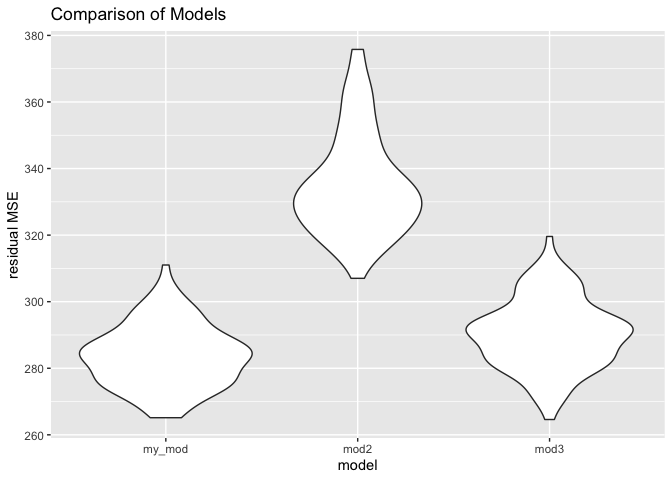
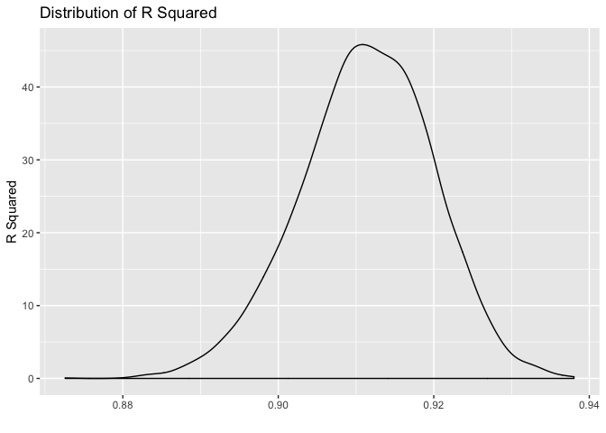
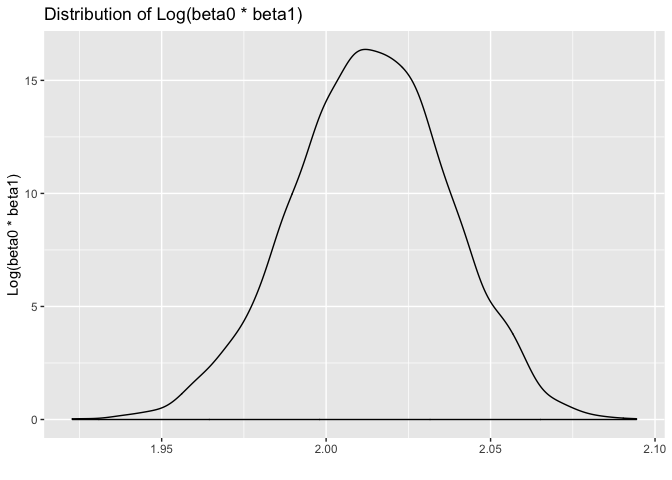
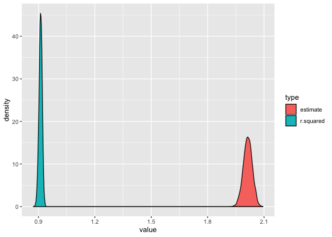

Homework 6
================
Charlotte Fowler
11/22/2019

``` r
library(tidyverse)
library(caret)
library(glmnet)
library(modelr)
library(mgcv)

set.seed(1)
```

# Problem 1

``` r
birthweight = read_csv("./data/birthweight.csv") %>% 
  mutate(
    babysex = factor(recode(babysex, "1" = "male", "2" = "female")), 
    frace = factor(recode(frace, "1" = "white", "2" = "black", "3" = "asian", "4" = "Puerto Rican", "8" = "other")), 
    mrace = factor(recode(mrace, "1" = "white", "2" = "black", "3" = "asian", "4" = "Puerto Rican", "8" = "other")), 
    malform = factor(recode(malform, "0" = "absent", "1" = "present")), 
  )


map_df(birthweight, function(x) any(is.na(x)))
```

    ## # A tibble: 1 x 20
    ##   babysex bhead blength bwt   delwt fincome frace gaweeks malform menarche
    ##   <lgl>   <lgl> <lgl>   <lgl> <lgl> <lgl>   <lgl> <lgl>   <lgl>   <lgl>   
    ## 1 FALSE   FALSE FALSE   FALSE FALSE FALSE   FALSE FALSE   FALSE   FALSE   
    ## # … with 10 more variables: mheight <lgl>, momage <lgl>, mrace <lgl>,
    ## #   parity <lgl>, pnumlbw <lgl>, pnumsga <lgl>, ppbmi <lgl>, ppwt <lgl>,
    ## #   smoken <lgl>, wtgain <lgl>

There are no missing values.

First I will run LASSO to select the most important variables, with
10-fold cross validation.

``` r
#Using LASSO to try models
lambda <- 10^seq(-3, 3, length = 100)
lasso <- 
  train(
    bwt ~., 
    data = birthweight, 
    method = "glmnet",
    trControl = trainControl("cv", number = 10),
    tuneGrid = expand.grid(alpha = 1, lambda = lambda)
  )
# best coefficients
coef(lasso$finalModel, lasso$bestTune$lambda)
```

    ## 25 x 1 sparse Matrix of class "dgCMatrix"
    ##                               1
    ## (Intercept)       -6.063641e+03
    ## babysexmale       -2.242589e+01
    ## bhead              1.302299e+02
    ## blength            7.479221e+01
    ## delwt              1.362416e+00
    ## fincome            2.392893e-01
    ## fraceblack         .           
    ## fraceother         .           
    ## fracePuerto Rican -1.166842e-02
    ## fracewhite         4.822791e+00
    ## gaweeks            1.112310e+01
    ## malformpresent     .           
    ## menarche          -1.343745e+00
    ## mheight            5.999250e+00
    ## momage             2.702166e-01
    ## mraceblack        -3.647314e+01
    ## mracePuerto Rican  .           
    ## mracewhite         9.176535e+01
    ## parity             6.698282e+01
    ## pnumlbw            .           
    ## pnumsga            .           
    ## ppbmi              .           
    ## ppwt               .           
    ## smoken            -4.349929e+00
    ## wtgain             2.510429e+00

Because this model still includes 14 predictors, I will use backwards
selection to choose the top 5 to include in my model.

``` r
#examining lasso model 
summary(lm(bwt~babysex + bhead + blength + delwt + fincome + frace + gaweeks + menarche + mheight + momage + mrace + parity + smoken + wtgain, data = birthweight))
```

    ## 
    ## Call:
    ## lm(formula = bwt ~ babysex + bhead + blength + delwt + fincome + 
    ##     frace + gaweeks + menarche + mheight + momage + mrace + parity + 
    ##     smoken + wtgain, data = birthweight)
    ## 
    ## Residuals:
    ##      Min       1Q   Median       3Q      Max 
    ## -1096.18  -184.97    -3.28   173.37  2343.93 
    ## 
    ## Coefficients:
    ##                     Estimate Std. Error t value Pr(>|t|)    
    ## (Intercept)       -6118.5770   146.1095 -41.877  < 2e-16 ***
    ## babysexmale         -28.6687     8.4621  -3.388 0.000711 ***
    ## bhead               130.8115     3.4500  37.917  < 2e-16 ***
    ## blength              74.9520     2.0209  37.088  < 2e-16 ***
    ## delwt                 1.3812     0.2363   5.846 5.41e-09 ***
    ## fincome               0.2903     0.1794   1.618 0.105779    
    ## fraceblack           -6.6506    78.8132  -0.084 0.932755    
    ## fraceother          -16.5286    97.5605  -0.169 0.865475    
    ## fracePuerto Rican   -68.2097    78.4520  -0.869 0.384652    
    ## fracewhite          -21.0968    69.2793  -0.305 0.760748    
    ## gaweeks              11.5439     1.4649   7.880 4.11e-15 ***
    ## menarche             -3.5779     2.8932  -1.237 0.216280    
    ## mheight               6.8160     1.8003   3.786 0.000155 ***
    ## momage                0.7699     1.2214   0.630 0.528491    
    ## mraceblack          -59.5444    80.9184  -0.736 0.461858    
    ## mracePuerto Rican    35.3717    80.9142   0.437 0.662023    
    ## mracewhite           92.0031    71.8741   1.280 0.200593    
    ## parity               95.3411    40.4655   2.356 0.018512 *  
    ## smoken               -4.8542     0.5867  -8.273  < 2e-16 ***
    ## wtgain                2.7202     0.4327   6.286 3.58e-10 ***
    ## ---
    ## Signif. codes:  0 '***' 0.001 '**' 0.01 '*' 0.05 '.' 0.1 ' ' 1
    ## 
    ## Residual standard error: 272.4 on 4322 degrees of freedom
    ## Multiple R-squared:  0.7183, Adjusted R-squared:  0.7171 
    ## F-statistic: 580.1 on 19 and 4322 DF,  p-value: < 2.2e-16

Choosing coefficients in order of significance, we’re left with head
circumfrance, length, the mother’s weight at delivery, the number of
gestational weeks, and the average number of cigarettes smoked per day
during the pregnancy.

``` r
#saving models
my_model = lm(bwt ~ bhead + blength + delwt + gaweeks + smoken, data = birthweight)

model2 = lm(bwt ~ blength + gaweeks, data = birthweight)

model3 = lm(bwt ~ bhead * babysex * blength, data = birthweight)
```

``` r
cv_df = 
  crossv_mc(birthweight, 100) 

cv_df =
  cv_df %>% 
  mutate(
    train = map(train, as_tibble),
    test = map(test, as_tibble))


cv_df = 
  cv_df %>% 
  mutate(my_mod  = map(train, ~lm(bwt ~ bhead + blength + delwt + gaweeks + smoken, data = .x)),
         mod2  = map(train, ~lm(bwt ~ blength + gaweeks, data = .x)),
         mod3  = map(train, ~lm(bwt ~ bhead * babysex * blength, data = .x))) %>% 
  mutate(rmse_my_mod = map2_dbl(my_mod, test, ~rmse(model = .x, data = .y)),
         rmse_mod2 = map2_dbl(mod2, test, ~rmse(model = .x, data = .y)),
         rmse_mod3 = map2_dbl(mod3, test, ~rmse(model = .x, data = .y)))
```

``` r
cv_df %>% 
  select(starts_with("rmse")) %>% 
  pivot_longer(
    everything(),
    names_to = "model", 
    values_to = "rmse",
    names_prefix = "rmse_") %>% 
  mutate(model = fct_inorder(model)) %>% 
  ggplot(aes(x = model, y = rmse)) + geom_violin() + 
  labs(title = "Comparison of Models", x = "model", y = "residual MSE")
```

<!-- -->

From the graph above, we can see that my model, the first, has the
lowest residual MSE, followed by the third model with interactions.
However, there is not very much difference between these two models. The
second model, with only the baby length and gestational age is by far
the worst model. My model has slightly less variation in residual MSE
compared to the two suggested models.

# Problem 2

``` r
#downloading the data
weather_df = 
  rnoaa::meteo_pull_monitors(
    c("USW00094728"),
    var = c("PRCP", "TMIN", "TMAX"), 
    date_min = "2017-01-01",
    date_max = "2017-12-31") %>%
  mutate(
    name = recode(id, USW00094728 = "CentralPark_NY"),
    tmin = tmin / 10,
    tmax = tmax / 10) %>%
  select(name, id, everything())
```

``` r
r_squared = function(x){
  broom::glance(x) %>% 
    select(r.squared)
}

log_b0b1 = function(x){
  log(broom::tidy(x)[1,2] * broom::tidy(x)[2,2])
}
```

``` r
boot_weather = weather_df %>% 
  modelr::bootstrap(n = 5000) %>% 
  mutate(
    models = map(strap, ~lm(tmax ~ tmin, data = .x) ),
    r_2 = map(models, r_squared),
    log_val = map(models, log_b0b1)
  ) %>% 
  select(r_2, log_val) %>% 
  unnest(c(r_2, log_val)) 
```

``` r
q2b = quantile(pull(boot_weather, estimate), 0.025)
q9b = quantile(pull(boot_weather, estimate), 0.975)

q2r = quantile(pull(boot_weather, r.squared), 0.025)
q9r = quantile(pull(boot_weather, r.squared), 0.975)
```

The 95 percent confidence interval for r^2 is (0.89, 0.93), and for
log(beta0 \* beta1) is (1.97, 2.06).

``` r
boot_weather %>% 
  ggplot(aes(x = r.squared)) +
  geom_density() + 
  labs(title = "Distribution of R Squared", y = "R Squared", x ="")
```

<!-- -->

``` r
boot_weather %>% 
  ggplot(aes(x = estimate)) +
  geom_density() + 
  labs(title = "Distribution of Log(beta0 * beta1)", y = "Log(beta0 * beta1)", x ="")
```

<!-- -->

``` r
boot_weather %>% 
  pivot_longer(r.squared:estimate, values_to = "value", names_to = "type") %>% 
  ggplot(aes(x = value, fill = type)) +
  geom_density()
```

<!-- -->
